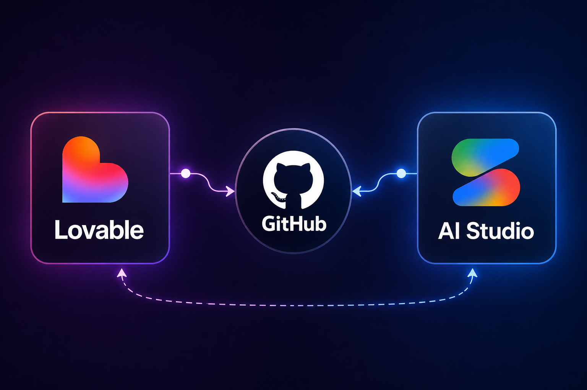

# 🔄 Two-Way Sync: Lovable ↔️ Google AI Studio

<p align="center">
  
  
</p>

<p align="center">
  
</p>

פתרון אוטומטי לסנכרון קוד דו-כיווני בין מאגרים נפרדים, שנועד לאפשר פיתוח היברידי עם כלי בינה מלאכותית, תוך חיסכון בעלויות (Credits) ומניעת התנגשויות קוד.

---

## 🎯 הבעיה

- **Lovable** הוא כלי מדהים לבניית Frontend ו-UI במהירות, אך צריכת הקרדיטים בו גבוהה מאוד.
- **Google AI Studio** מספק סביבה מצוינת לפיתוח מורכב של הלוגיקה וה-Backend עם מגבלת שימוש נדיבה בהרבה.
- **האתגר:** אף אחד מהכלים לא מאפשר התחברות למאגר Git קיים המשותף לשניהם, מה שמונע עבודה רציפה על אותו הפרויקט.

---

## 💡 הפתרון (המעקף)

הקמת **שני מאגרי GitHub נפרדים** (אחד לכל כלי), וחיבורם באמצעות **GitHub Actions** לסנכרון אוטומטי מלא.

### הסקריפטים כוללים מנגנוני הגנה מתקדמים:

- ✅ סנכרון כירורגי עם `rsync`
- ✅ הגנה על קבצי האוטומציה של כל מאגר
- ✅ מניעת לולאות סנכרון אינסופיות (Commit Ping-Pong)

> ℹ️ תיקיית `.github/workflows` מוחרגת מהסנכרון כדי למנוע מצב שבו אחד המאגרים מוחק או דורס את קבצי האוטומציה של השני.

> ⚠️ הסנכרון משתמש ב־`rsync --delete`, כלומר קבצים שלא קיימים במאגר המקור יימחקו ממאגר היעד.

---

# ⚙️ הוראות התקנה והגדרה

## שלב 1: יצירת Personal Access Token (PAT)

כדי שהאקשנים יוכלו לדחוף קוד ממאגר אחד לשני, נדרש מפתח הרשאה (Token) של החשבון שלכם.

1. ב-GitHub לחצו על תמונת הפרופיל → **Settings**
2. בתפריט השמאלי → **Developer settings**
3. היכנסו ל:
   - **Personal access tokens**
   - **Tokens (classic)**
4. לחצו על:
   - **Generate new token (classic)**
5. תנו שם לטוקן (למשל `SYNC_TOKEN`)
6. הגדירו:
   - Expiration → `No expiration`
7. סמנו הרשאות:
   - `repo`
   - `workflow`
8. לחצו Generate והעתיקו את הטוקן

> ⚠️ חשוב: בחרו `No expiration` כדי שהסנכרון לא יפסיק לעבוד בעתיד כשהטוקן יפוג.

> ⚠️ שמרו את הטוקן במקום בטוח — לא תוכלו לראות אותו שוב.

---

## שלב 2: הגדרת Secrets בשני המאגרים

בצעו את הפעולה גם במאגר של Lovable וגם במאגר של AI Studio:

1. Repository → **Settings**
2. **Secrets and variables**
3. **Actions**
4. **New repository secret**

הגדירו:

```txt
Name: SYNC_TOKEN
```

והדביקו את הטוקן בשדה Value.

---

# שלב 3: האוטומציה למאגר של Lovable

> ⚠️ אם הבראנץ' הראשי שלכם נקרא `master` במקום `main`, החליפו זאת בקבצי ה־workflow.

> 💡 מומלץ להתחיל עם מאגר אחד "ראשי", ולתת לסנכרון הראשוני להעתיק את כל הקבצים למאגר השני.

צרו קובץ:

```txt
.github/workflows/sync-to-studio.yml
```

והדביקו:

```yaml
name: Sync to AI Studio Repo

on:
  push:
    branches: [main]

jobs:
  sync:
    runs-on: ubuntu-latest

    # הגנה מפני לולאת עדכון אינסופית
    if: github.actor != 'github-actions[bot]' && !contains(github.event.head_commit.message, 'Auto-sync updates')

    steps:
      - name: Checkout source repo
        uses: actions/checkout@v4
        with:
          path: source-repo
          token: ${{ secrets.SYNC_TOKEN }}

      - name: Checkout target repo
        uses: actions/checkout@v4
        with:
          # 👇 החליפו לשם המשתמש ושם המאגר של AI Studio
          repository: USERNAME/AI-STUDIO-REPO
          token: ${{ secrets.SYNC_TOKEN }}
          path: target-repo

      - name: Sync files (excluding workflows)
        run: |
          rsync -av --delete \
            --exclude='.git/' \
            --exclude='.github/workflows/' \
            source-repo/ target-repo/

      - name: Commit and push changes
        run: |
          cd target-repo

          git config user.name "GitHub Sync Bot"
          git config user.email "action@github.com"

          git add .

          if ! git diff-index --quiet HEAD; then
            git commit -m "Auto-sync updates from Lovable"
            git push
          else
            echo "No changes to sync."
          fi
```

---

# שלב 4: האוטומציה למאגר של AI Studio

צרו קובץ:

```txt
.github/workflows/sync-to-lovable.yml
```

והדביקו:

```yaml
name: Sync to Lovable Repo

on:
  push:
    branches: [main]

jobs:
  sync:
    runs-on: ubuntu-latest

    # הגנה מפני לולאת עדכון אינסופית
    if: github.actor != 'github-actions[bot]' && !contains(github.event.head_commit.message, 'Auto-sync updates')

    steps:
      - name: Checkout source repo
        uses: actions/checkout@v4
        with:
          path: source-repo
          token: ${{ secrets.SYNC_TOKEN }}

      - name: Checkout target repo
        uses: actions/checkout@v4
        with:
          # 👇 החליפו לשם המשתמש ושם המאגר של Lovable
          repository: USERNAME/LOVABLE-REPO
          token: ${{ secrets.SYNC_TOKEN }}
          path: target-repo

      - name: Sync files (excluding workflows)
        run: |
          rsync -av --delete \
            --exclude='.git/' \
            --exclude='.github/workflows/' \
            source-repo/ target-repo/

      - name: Commit and push changes
        run: |
          cd target-repo

          git config user.name "GitHub Sync Bot"
          git config user.email "action@github.com"

          git add .

          if ! git diff-index --quiet HEAD; then
            git commit -m "Auto-sync updates from AI Studio"
            git push
          else
            echo "No changes to sync."
          fi
```

---

# 🛠️ דגשים לעבודה השוטפת

## 1. עבודה מ-AI Studio ל-Lovable

כאשר דוחפים קוד מ-AI Studio:

1. הקוד עובר ל-GitHub
2. ה-Action מופעל
3. המאגר של Lovable מתעדכן אוטומטית

✅ Lovable יודע לבצע Pull אוטומטי ולכן השינויים יופיעו שם לבד.

---

## 2. עבודה מ-Lovable ל-AI Studio

כאשר Lovable דוחף שינויים:

1. ה-Action מעדכן את המאגר של AI Studio
2. אבל AI Studio לא מבצע Pull אוטומטי לקוד שבאתר

לכן:

- פתחו את טאב GitHub בתוך AI Studio
- שם יוצגו ההבדלים
- משכו / העתיקו את השינויים ידנית

---

# ❗ תקלות נפוצות

## Permission denied

ודאו שה־PAT כולל:

- `repo`
- `workflow`

---

## Workflow לא רץ

בדקו ש־GitHub Actions מופעל במאגר.

---

## אין סנכרון

ודאו שהשם של ה־Secret הוא בדיוק:

```txt
SYNC_TOKEN
```

---

# 🔐 אבטחה

לעולם אל תעלו את ה־PAT ישירות לקוד או ל־README.

השתמשו רק ב־GitHub Secrets.

---

# ✅ סיימתם

מעכשיו שני המאגרים מסונכרנים אוטומטית אחד עם השני 🚀
